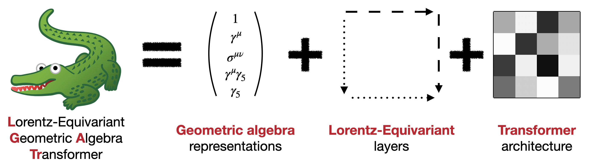

<div align="center">

# Lorentz-Equivariant Geometric Algebra Transformer

[](https://arxiv.org/abs/2405.14806)
[](https://arxiv.org/abs/2411.00446)
[](https://pytorch.org/get-started/locally/)
[](https://hydra.cc/)
[](https://black.readthedocs.io/en/stable/)

</div>

This repository contains the official implementation of the **Lorentz-Equivariant Geometric Algebra Transformer (L-GATr)** by [Jonas Spinner](mailto:j.spinner@thphys.uni-heidelberg.de), [Víctor Bresó](mailto:breso@thphys.uni-heidelberg.de), Pim de Haan, Tilman Plehn, Huilin Qu, Jesse Thaler, and Johann Brehmer. L-GATr uses spacetime geometric algebra representations to construct Lorentz-equivariant layers and combines them into a transformer architecture.



You can read more about L-GATr in the following two preprints. This repository contains the code to reproduce their main results:

- [Lorentz-Equivariant Geometric Algebra Transformers for High-Energy Physics](https://arxiv.org/abs/2405.14806) (targeted at a computer science audience)
- [A Lorentz-Equivariant Transformer for All of the LHC](https://arxiv.org/abs/2411.00446) (targeted at a high-energy physics audience)

## 1. Getting started

Clone the repository
```bash
git clone https://github.com/heidelberg-hepml/lorentz-gatr
```

Create a virtual environment and install requirements
```bash
python -m venv venv
source venv/bin/activate
pip install -r requirements.txt
```

In case you want to run our experiments, you first have to collect the datasets. They can be downloaded from the Heidelberg ITP website ([amplitudes](https://www.thphys.uni-heidelberg.de/~plehn/data/amplitudes.hdf5), [toptagging](https://www.thphys.uni-heidelberg.de/~plehn/data/toptagging_full.npz), [event-generation](https://www.thphys.uni-heidelberg.de/~plehn/data/event_generation_ttbar.hdf5)). hdf5 archives have to be unpacked to npy files for each key in the archive. Finally, keys in the `data` section of the config files have to be adapted to specify where the datasets are located on your machine (`data_path` or `data_dir` depending on the experiment). The following command automates this procedure, and modifying the script allows you to collect only some datasets
```bash
python data/collect_data.py
```

## 2. Running experiments

You can run any of our experiments with the following commands, the results will be stored in a folder called `runs/exp_name/run_name`, where `exp_name` and `run_name` can be specified in the config file
```bash
python run.py -cn amplitudes model=gatr_amplitudes
python run.py -cn toptagging model=gatr_toptagging
python run.py -cn ttbar model=gatr_eventgen
```

We use hydra for configuration management, allowing to quickly override parameters in e.g. `config/amplitudes.yaml`. The default configuration files for quick test experiments are located in the `config` folder, whereas longer experiments to reproduce the results of the papers can be found in `config_paper`. You can select the config file with `-cn`, and its location with `-cp`. Hyperparameters of the config file can be simply overwritten as extra command line arguments. For instance, to train a amplitude regression L-GATr for 10k iterations
```bash
python run.py -cp config_paper -cn amplitudes training.iterations=10000
```

Further, we use mlflow for tracking. You can start a mlflow server based on the saved results in `runs/tracking/mlflow.db` on port 4242 of your machine with the following command

```bash
mlflow ui --port 4242 --backend-store-uri sqlite:///path/to/runs/tracking/mlflow.db
```

An existing run can be reloaded to perform additional tests using the trained model. For a previous run with `exp_name=amplitudes` and `run_name=hello_world`, one can run for example. 

```bash
python run.py -cp runs/amplitudes/hello_world -cn config train=false warm_start_idx=0
```

The `warm_start_idx` specifies which model in the models folder should be loaded and defaults to `warm_start_idx=0`. 

## 3. Using L-GATr 

To use L-GATr on your own problem, you will at least need two components from this repository:
- The L-GATr network, which acts on multivector data (in `gatr/nets/gatr.py`)
- Interface functions that embed various geometric
objects into this multivector representations (in `gatr/interface/`)

Here is an example code snippet for a GATr jet tagger that illustrates the recipe, you can find more examples at `experiments/amplitudes/wrappers.py`, `experiments/tagging/wrappers.py` and `experiments/eventgen/wrappers.py`

```python
from gatr import GATr, SelfAttentionConfig, MLPConfig
from gatr.interface import embed_vector, extract_scalar, embed_spurions
import torch


class ExampleWrapper(torch.nn.Module):
    """Example wrapper around a L-GATr model.
    
    Parameters
    ----------
    num_blocks : int
        Number of transformer blocks
    hidden_mv_channels : int
        Number of hidden multivector channels
    hidden_s_channels : int
        Number of hidden scalar channels
    """

    def __init__(self, blocks=6, hidden_mv_channels=16, hidden_s_channels=32):
        super().__init__()
        self.gatr = GATr(
            in_mv_channels=3,
            out_mv_channels=1,
            hidden_mv_channels=hidden_mv_channels,
            in_s_channels=None,
            out_s_channels=None,
            hidden_s_channels=hidden_s_channels,
            num_blocks=num_blocks,
            attention=SelfAttentionConfig(),  # Use default parameters for attention
            mlp=MLPConfig(),  # Use default parameters for MLP
        )
        
    def forward(self, fourmomenta):
        """Forward pass.
        
        Parameters
        ----------
        fourmomenta : torch.Tensor with shape (batchsize, num_points, 4)
            fourmomentum point cloud input data
        
        Returns
        -------
        outputs : torch.Tensor with shape (batchsize, 1)
            Model prediction: a single scalar for the whole point cloud.
        """
        batchsize, num_points, _ = fourmomenta.shape
        
        # Embed fourmomentum point cloud inputs in GA
        multivectors = embed_vector(fourmomenta).unsqueeze(-2)  # (batchsize, num_points, 1, 16)
        
        # Append spurions for symmetry breaking (optional)
        spurions = embed_spurions(beam_reference="xyplane", add_time_reference=True, device=fourmomenta.device, dtype=fourmomenta.dtype)  # (2, 16)
        spurions = spurions[None, None, ...].repeat(batchsize, num_points, 1, 1)  # (batchsize, num_points, 2, 16)
        multivectors = torch.cat((multivectors, spurions), dim=-2)  # (batchsize, num_points, 3, 16)
        
        # Pass data through GATr
        multivector_outputs, _ = self.gatr(multivectors, scalars=None)  # (batchsize, num_points, 1, 16)
        
        # Extract scalar outputs 
        outputs = extract_scalar(multivector)  # (batchsize, num_points, 1)
        
        # Mean aggregation to extract a single scalar for the whole point cloud
        score = outputs.mean(dim=1)
        
        return score
```

In the following, we will go into more detail on the conventions used in this code base and the
structure of the repository.

### Design choices

**Representations**: L-GATr operates with two kind of representations: geometric algebra multivectors
and auxiliary scalar representations. Both are simply represented as `torch.Tensor` instances.

The multivectors are based on the spacetime geometric algebra Cl(1, 3). They are tensors of the
shape `(..., 16)`, for instance `(batchsize, items, channels, 16)`. The sixteen multivector
components are sorted as in the
[`clifford` library](https://clifford.readthedocs.io/en/latest/), as follows:
`[x_scalars, x_0, x_1, x_2, x_3, x_01, x_02, x_03, x_12, x_13, x_23, x_012, x_013, x_023, x_123,
x_0123]`, or `[x_S, x_V0, x_V1, x_V2, x_V3, x_B01, x_B02, x_B03, x_B12, x_B13, x_B23, x_A3, x_A2, x_A1, x_A0, x_P]` in the notation of [A Lorentz-Equivariant Transformer for All of the LHC](https://arxiv.org/abs/2411.00446).

Scalar representations have free shapes, but should match the multivector representations they
accompany in batchsize and number of items. The number of channels may be different.

**Functions**: We distinguish between primitives (functions) and layers (`torch.nn.Module` instances). All primitives and layers are Lorentz-equivariant.

### Repository structure

```text
lorentz-gatr
|
└───config: configuration YAML files for the experiments, with small models and few iterations to quickly test the code
|   └───model: model configurations
|   └───classifier: classifier metric configuration (event generation experiment)
|   |   amplitudes.yaml: configuration for the amplitude experiment
|   |   default.yaml: default configuration
|   |   hydra.yaml: hydra configuration
|   |   default_tagging.yaml: default configuration for tagging experiments
|   |   toptagging.yaml: configuration for the top-tagging experiment
|   |   jctagging.yaml: configuration for the JetClass tagging experiment
|   |   qgtagging.yaml: configuration for the quark-gluon-tagging experiment
|   |   ttbar.yaml: configuration for the ttbar event-generation experiment
|   |   zmumu.yaml: configuration for the z->mumu event-generation experiment
|
└───config_paper: configuration YAML files for the experiments, with the hyperparameters used in the paper
|   └───model: model configurations
|   └───classifier: classifier metric configuration (event generation experiment)
|   |   amplitudes.yaml: configuration for the amplitude experiment
|   |   default.yaml: default configuration
|   |   hydra.yaml: hydra configuration
|   |   toptagging.yaml: configuration for the toptagging experiment
|   |   ttbar.yaml: configuration for the ttbar event-generation experiment
|
└───data: space to store datasets
|   |   download_data.py: download and unpack datasets
|
└───experiments: experiments that use gatr
|   └───baselines: baseline layers and architectures
|   └───amplitudes: amplitude experiment
|   └───tagging: tagging experiments
|   └───eventgen: event generation experiments
|   |
|   |   misc.py: various utility functions
|   |   logger.py: Logger setup
|   |   mlflow.py: MLFlow logger 
|   |   base_experiment.py: Base class for all experiments including model, optimizer and scheduler initialization, logging protocol and training/validation loops
|   |   base_plots.py: Example plot functions (not used)
|   |   base_wrapper.py: Example wrapper for L-GATr (not used) 
│
└───gatr: core library
|   └───interface: embedding of geometric quantities into projective geometric algebra
|   |   |   vector.py: Lorentz vectors
|   |   |   scalar.py: scalars
|   |   |   spurions.py: spurions for symmetry breaking
|   |
|   └───layers: network layers
|   |   └───attention: self-attention layer, its components, and the corresponding configuration
|   |   └───mlp: geometric MLP, its components, and the corresponding configuration
|   |   |   dropout.py: multivector dropout
|   |   |   gatr_block.py: L-GATr transformer block, the main layer that L-GATr networks consist of
|   |   |   layer_norm.py: geometric LayerNorm
|   |   |   linear.py: equivariant linear layer between multivectors
|   |
|   └───nets: complete network architectures
|   |   |   axial_gatr.py: axial-attention version of L-GATr for two token dimensions
|   |   |   gatr.py: L-GATr architecture for a single token dimension
|   |   |   gap.py: L-GATr architecture without the transformer module
|   |
|   └───primitives: core functional building blocks of L-GATr
|   |   |   attention.py: geometric attention mechanism
|   |   |   bilinear.py: bilinear equivariant functions like the geometric product
|   |   |   dropout.py: geometric dropout
|   |   |   invariants.py: invariant functions of multivectors like the norm
|   |   |   linear.py: equivariant linear maps between multivectors
|   |   |   nonlinearities.py: gated nonlinearities
|   |   |   normalization.py: geometric normalization functions
|   |
|   └───utils: utility functions
|       |   clifford.py: non-differentiable GA functions based on the clifford library
|       |   einsum.py: optimized einsum function
|       |   tensors.py: various tensor operations
|
└───img: images
│
└───tests: unit tests (e.g. for self-consistency and Pin equivariance)
|   └───gatr
|   |   └───interface: unit tests for gatr.interface
|   |   └───layers: unit tests for gatr.layers
|   |   └───nets: unit tests for gatr.nets
|   |   └───primitives: unit tests for gatr.primitives
|   |   └───utils: unit tests for gatr.utils
|   |
|   └───helpers: utility functions for unit tests
|   |   |   constants.py: test settings (like tolerances)
|   |   |   equivariance.py: helper functions to test Pin equivariance
|   |   |   geometric_algebra.py: helper functions to test GA functionality
|   |
|   └───experiments
|   |   └───eventgen: unit tests for base distributions and transforms/coordinates classes
│
└───tests_regression: regression tests
│  
|   .gitignore: git configuration
│   LICENSE: license under which this code may be used
|   pyproject.toml: project settings
│   README.md: this README file
|   requirements.txt: external dependencies
```

## 4. Extra features in this repository

Here we list some additional functional elements of the code that are not explicitly mentioned in the paper:

1. Tagging experiment for a quark gluon dataset containing extra scalar features
2. Extra options in the tagging experiment to include more scalar variables, mean aggregation etc
3. Extra base distributions and variable parametrizations for event generation
4. Event generation experiment for Z + jets
5. Switches to control the geometric algebra representations  under `ga_settings` in `config/default.yaml`, e.g. to turn off the bivector representations, turn off the geometric product, or have equivariance under the full Lorentz group including parity and time reversal
6. Features of the original GATr repo that we do not use: Positional encodings, axial transformer and axial L-GATr build
7. More options for the transformer architecture: `dropout`, several activation functions (`relu`, `gelu`, `sigmoid`), `multi_query` attention, `increase_hidden_channels` option for the transformer MLP, `double_layernorm` before and after attention/MLP blocks, `head_scale` (learnable coefficients for each attention head), option to reinsert input channels in each attention step
8. `CrossAttention`, `ConditionalGATrBlock`, `ConditionalGATr` as GATr versions of `torch.nn.TransformerDecoderLayer` and `torch.nn.Transformer`. They are covered by unit tests, but we did not use them in any experiments yet.

## 5. Citation

If you find this code useful in your research, please cite the following papers

```bibtex
@article{Brehmer:2024yqw,
    author = "Brehmer, Johann and Bres\'o, V\'\i{}ctor and de Haan, Pim and Plehn, Tilman and Qu, Huilin and Spinner, Jonas and Thaler, Jesse",
    title = "{A Lorentz-Equivariant Transformer for All of the LHC}",
    eprint = "2411.00446",
    archivePrefix = "arXiv",
    primaryClass = "hep-ph",
    reportNumber = "MIT-CTP/5802",
    month = "11",
    year = "2024"
}
@inproceedings{spinner2025lorentz,
  title={Lorentz-Equivariant Geometric Algebra Transformers for High-Energy Physics},
  author={Spinner, Jonas and Bres{\'o}, Victor and De Haan, Pim and Plehn, Tilman and Thaler, Jesse and Brehmer, Johann},
  booktitle={Advances in Neural Information Processing Systems},
  year={2024},
  volume={37},
  eprint = {2405.14806},
  url = {https://arxiv.org/abs/2405.14806}
}
@inproceedings{brehmer2023geometric,
  title = {Geometric Algebra Transformer},
  author = {Brehmer, Johann and de Haan, Pim and Behrends, S{\"o}nke and Cohen, Taco},
  booktitle = {Advances in Neural Information Processing Systems},
  year = {2023},
  volume = {36},
  eprint = {2305.18415},
  url = {https://arxiv.org/abs/2305.18415},
}
```

